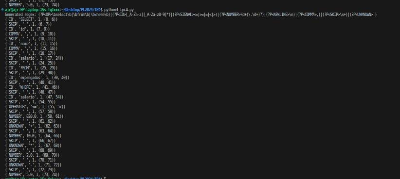

# PL2024

## Autor 

**Nome:** Ana Joao Alves

**ID:** A95128

# ENUNCIADO

O código que se segue é uma criação de um interpretador simples para uma máquina de vendas, sendo possível executar tarefas como selecionar um produto, listar os produtos disponíveis e inserir moedas.

##IMPLEMENTAÇÃO

**Resultado:** 

